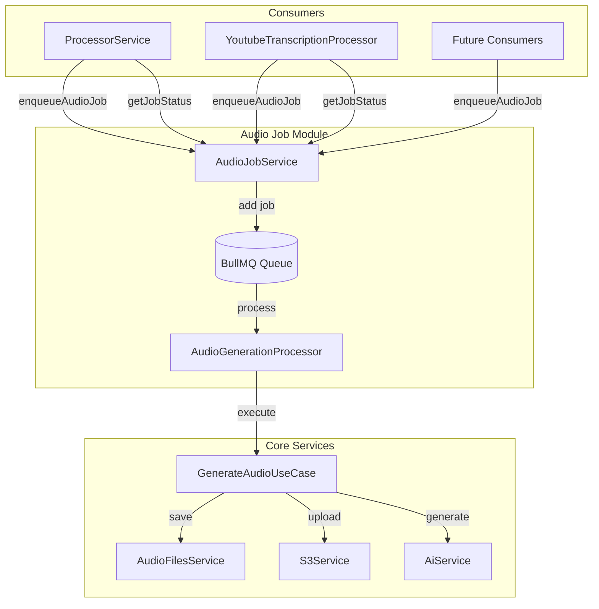
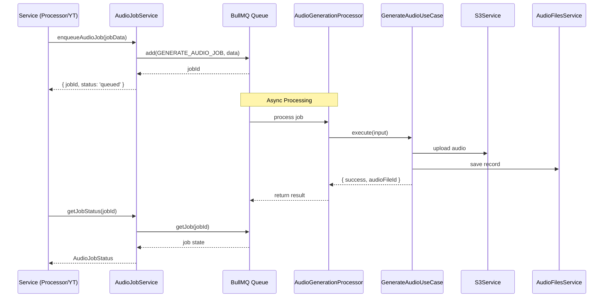

# Audio Generation Job Module Refactor Plan

## Overview

Refactor the audio generation functionality currently embedded in `src/processor/processor.service.ts` into a standalone, reusable job module with a well-defined interface that enables invocation from multiple locations throughout the application.

## Current State

### Problem
- Audio generation is tightly coupled to `ProcessorService.processArticles()` and `YoutubeTranscriptionProcessor`
- Direct calls to `GenerateAudioUseCase.execute()` create tight coupling
- No async job handling - audio generation blocks the main processing flow
- No job status tracking or retrieval capability
- Limited reusability across different parts of the application

### Current Usage Locations
1. **ProcessorService** (`src/processor/processor.service.ts:102-120`)
   - Called during article processing when `generateAudio` flag is true
   - Direct dependency on `GenerateAudioUseCase`

2. **YoutubeTranscriptionProcessor** (`src/youtube-transcriptions/processors/youtube-transcription.processor.ts:83-106`)
   - Called during transcription summary processing
   - Direct dependency on `GenerateAudioUseCase`

## Proposed Architecture

### New Components

#### 1. Queue Constants (`libs/queue/constants/queue.constants.ts`)
Add audio generation queue constants:
```typescript
export const AUDIO_GENERATION_QUEUE = 'audio-generation';
export const GENERATE_AUDIO_JOB = 'generate-audio';
```

#### 2. Audio Job Interface (`libs/queue/interfaces/audio-job.interface.ts`)
```typescript
export interface GenerateAudioJobData {
  sourceType: 'article' | 'transcription';
  sourceId: string;
  text: string;
  date: Date;
  voice?: string;
}

export interface AudioJobStatus {
  jobId: string;
  state: string;
  progress: string | boolean | number | object;
  result?: {
    success: boolean;
    audioFileId?: string;
    error?: string;
  };
  error?: string;
  data: GenerateAudioJobData;
}
```

#### 3. Audio Job Service (`libs/queue/services/audio-job.service.ts`)
Responsible for:
- Enqueueing audio generation jobs
- Retrieving job status by ID
- Listing jobs by source type/source ID
- Cancelling pending jobs

#### 4. Audio Generation Processor (`libs/queue/processors/audio-generation.processor.ts`)
BullMQ worker that:
- Processes audio generation jobs from the queue
- Uses `GenerateAudioUseCase` to perform actual generation
- Handles job progress updates
- Implements retry logic for failed jobs

### Architecture Diagram



### Data Flow



## Implementation Steps

### Phase 1: Create Core Infrastructure

#### Step 1.1: Update Queue Constants
**File**: `libs/queue/constants/queue.constants.ts`
**Action**: Add audio generation queue constants
```typescript
export const AUDIO_GENERATION_QUEUE = 'audio-generation';
export const GENERATE_AUDIO_JOB = 'generate-audio';
```

#### Step 1.2: Create Audio Job Interface
**File**: `libs/queue/interfaces/audio-job.interface.ts` (NEW)
**Action**: Define `GenerateAudioJobData` and `AudioJobStatus` interfaces

#### Step 1.3: Create Audio Job Service
**File**: `libs/queue/services/audio-job.service.ts` (NEW)
**Responsibilities**:
- `enqueueAudioJob(data: GenerateAudioJobData, options?: EnqueueOptions): Promise<JobInfo>`
- `getJobStatus(jobId: string): Promise<AudioJobStatus>`
- `getJobsBySource(sourceType: string, sourceId: string): Promise<AudioJobStatus[]>`
- `cancelJob(jobId: string): Promise<boolean>`

```typescript
export interface EnqueueOptions {
  waitForCompletion?: boolean; // For backward compatibility
  priority?: number;
  delay?: number;
}
```

#### Step 1.4: Create Audio Generation Processor
**File**: `libs/queue/processors/audio-generation.processor.ts` (NEW)
**Responsibilities**:
- Initialize BullMQ Worker for `AUDIO_GENERATION_QUEUE`
- Process jobs using `GenerateAudioUseCase`
- Handle job lifecycle events (completed, failed, progress)
- Implement retry logic with exponential backoff

**Retry Configuration**:
```typescript
{
  attempts: 3,
  backoff: {
    type: 'exponential',
    delay: 2000, // 2s, 4s, 8s
  },
  removeOnComplete: {
    count: 100, // Keep last 100 completed jobs
  },
  removeOnFail: {
    count: 500, // Keep last 500 failed jobs for debugging
  },
  concurrency: 2, // Process 2 audio jobs in parallel
}
```

**Error Classification**:
- **Retryable**: Network timeouts, S3 throttling, temporary AI service unavailability, rate limit errors
- **Fatal**: Invalid input data, missing environment variables, authentication failures, malformed job data

#### Step 1.5: Add Monitoring and Logging
**File**: `libs/queue/processors/audio-generation.processor.ts` (enhanced)
**Responsibilities**:
- Add structured logging with correlation IDs
- Emit metrics for observability
- Implement queue monitoring capabilities

**Metrics to Track**:
- Job duration histogram (success vs failure)
- Queue depth gauge
- Success rate counter
- Retry counter

**Logging Requirements**:
- Job start/end with elapsed time
- Retry attempts with retry count
- Progress updates (0%, 25%, 50%, 75%, 100%)
- Structured format: `{ jobId, sourceType, sourceId, operation, status, durationMs, error? }`

### Phase 2: Update Queue Module

#### Step 2.1: Update QueueModule
**File**: `libs/queue/queue.module.ts`
**Changes**:
- Add `forwardRef(() => AudioFilesModule)` to imports to resolve circular dependency
- Add `AUDIO_GENERATION_QUEUE` provider with retry configuration
- Add `AudioJobService` to providers
- Add `AudioGenerationProcessor` to providers
- Update exports

```typescript
@Module({
  imports: [
    forwardRef(() => ProcessorModule),
    forwardRef(() => AudioFilesModule), // Resolves circular dependency
    ConfigModule,
    EmailModule.forRoot(),
    S3Module,
    RedisModule,
  ],
  providers: [
    // ... existing queue providers ...
    {
      provide: AUDIO_GENERATION_QUEUE,
      useFactory: (redisService: RedisService) => {
        return new Queue(AUDIO_GENERATION_QUEUE, {
          connection: redisService.getClient(),
          defaultJobOptions: {
            attempts: 3,
            backoff: { type: 'exponential', delay: 2000 },
            removeOnComplete: { count: 100 },
            removeOnFail: { count: 500 },
          },
        });
      },
      inject: [RedisService],
    },
    AudioJobService,
    AudioGenerationProcessor,
  ],
  exports: [
    // ... existing queue exports ...
    AUDIO_GENERATION_QUEUE,
    AudioJobService,
  ],
})
```

#### Step 2.2: Update Queue Index
**File**: `libs/queue/index.ts`
**Changes**: Export new types and services

### Phase 3: Refactor Existing Code

#### Step 3.1: Update ProcessorService
**File**: `src/processor/processor.service.ts`
**Changes**:
- Replace `GenerateAudioUseCase` dependency with `AudioJobService`
- Change direct execution to job enqueueing
- Keep `generateAudio` flag for backward compatibility

**Implementation**:
```typescript
// Before: Direct execution
if (generateAudio) {
  const audioResult = await this.generateAudioUseCase.execute({...});
}

// After: Async job enqueueing
if (generateAudio) {
  const jobInfo = await this.audioJobService.enqueueAudioJob({
    sourceType: 'article',
    sourceId: article.id,
    text: summary,
    date: article.published_date ? new Date(article.published_date) : new Date(),
  });
  console.log(`Audio generation job enqueued: ${jobInfo.jobId}`);
}
```

#### Step 3.2: Update YoutubeTranscriptionProcessor
**File**: `src/youtube-transcriptions/processors/youtube-transcription.processor.ts`
**Changes**:
- Replace `GenerateAudioUseCase` dependency with `AudioJobService`
- Change direct execution to job enqueueing

#### Step 3.3: Update Module Dependencies
**Files**:
- `src/processor/processor.module.ts`
- `src/youtube-transcriptions/youtube-transcriptions.module.ts`

**Changes**: Update imports to use `AudioJobService` from `@libs/queue` instead of `GenerateAudioUseCase`

#### Step 3.4: Add Backward Compatibility Wrapper (NEW)
**File**: `libs/queue/services/audio-job.service.ts` (enhanced)
**Responsibilities**:
- Support synchronous mode for compatibility with existing tests and critical flows

```typescript
async enqueueAudioJob(
  data: GenerateAudioJobData,
  options?: { waitForCompletion?: boolean; timeout?: number }
): Promise<JobInfo | AudioJobStatus> {
  const job = await this.audioQueue.add(GENERATE_AUDIO_JOB, data);
  const jobId = String(job.id);

  // Fire-and-forget mode (default)
  if (!options?.waitForCompletion) {
    return { jobId, status: 'queued' };
  }

  // Synchronous mode for backward compatibility
  const timeoutMs = options.timeout || 60000; // 1 minute default
  const completedJob = await job.waitUntilCompleted(timeoutMs);
  return this.mapJobToStatus(completedJob);
}
```

### Phase 4: Verification and Testing

#### Step 4.1: Dependency Check
- Verify no circular dependencies introduced (use `forwardRef` if needed)
- Ensure `AudioFilesModule` is properly imported where needed
- Check that `QueueModule` exports are sufficient
- Run NestJS module initialization test to verify all modules load correctly

#### Step 4.2: Interface Validation
- Verify `AudioJobService` interface is clean and reusable
- Ensure job status retrieval works correctly
- Test error handling paths (retryable vs fatal errors)
- Verify job data sanitization (no sensitive data in queue)

#### Step 4.3: Test Migration
**Updates needed**:
- Mock `AudioJobService` in `ProcessorService` tests
- Mock `AudioJobService` in `YoutubeTranscriptionProcessor` tests
- Add new tests for `AudioJobService`
- Add new tests for `AudioGenerationProcessor`
- Add integration tests for end-to-end job flow

**Test Scenarios**:
1. Successful job enqueueing
2. Job status retrieval
3. Retry behavior (exponential backoff)
4. Fatal error handling (no retry)
5. Cancel pending job
6. Synchronous mode (waitForCompletion)

### Phase 5: Documentation and Migration Guide (NEW)

#### Step 5.1: Create Migration Guide
**File**: `docs/migrations/audio-generation-queue-migration.md` (NEW)

**Contents**:
1. **Overview**: What changed and why
2. **Breaking Changes**: Synchronous -> asynchronous behavior
3. **How to Check Job Status**: Use `getJobStatus(jobId)`
4. **How to Handle Failures**: Monitor failed jobs, retry capability
5. **Test Migration Examples**:
   - Before: Mock `GenerateAudioUseCase`
   - After: Mock `AudioJobService.enqueueAudioJob()`
6. **Rollback Strategy**: Feature flags, old code path preservation

#### Step 5.2: Update API Documentation
**File**: Update relevant docs in `docs/` directory

**Add documentation for**:
- `AudioJobService` public API
- Job status lifecycle (queued -> processing -> completed/failed)
- Monitoring and metrics
- Troubleshooting guide (common issues and solutions)

#### Step 5.3: Runbooks
**Create operational runbooks for**:
- Monitoring queue health
- Handling stuck/failed jobs
- Scaling audio generation workers
- Redis maintenance (job cleanup, migration)

## Updated File Changes Summary

### New Files
1. `libs/queue/interfaces/audio-job.interface.ts`
2. `libs/queue/services/audio-job.service.ts`
3. `libs/queue/processors/audio-generation.processor.ts`
4. `docs/migrations/audio-generation-queue-migration.md`

### Modified Files
1. `libs/queue/constants/queue.constants.ts` - Add constants
2. `libs/queue/queue.module.ts` - Add providers, exports, and `forwardRef`
3. `libs/queue/index.ts` - Export new types and services
4. `src/processor/processor.service.ts` - Use new service
5. `src/processor/processor.module.ts` - Update imports
6. `src/youtube-transcriptions/processors/youtube-transcription.processor.ts` - Use new service
7. `src/youtube-transcriptions/youtube-transcriptions.module.ts` - Update imports

### Test Files to Add/Update
1. `libs/queue/services/audio-job.service.spec.ts` (NEW)
2. `libs/queue/processors/audio-generation.processor.spec.ts` (NEW)
3. `src/processor/processor.service.spec.ts` - Update mocks
4. `src/youtube-transcriptions/processors/youtube-transcription.processor.spec.ts` - Update mocks

## Benefits

1. **Separation of Concerns**: Audio generation is now an async background concern
2. **Reusability**: Any service can enqueue audio jobs via `AudioJobService`
3. **Scalability**: Separate concurrency control for audio jobs
4. **Observability**: Job status tracking and retrieval
5. **Maintainability**: Clear interfaces, single responsibility
6. **Testability**: Easier to mock and test components in isolation

## Backward Compatibility

- The `generateAudio` flag in existing DTOs can be preserved
- Job enqueueing is fire-and-forget; existing flows continue to work
- Optional: Add sync wrapper for cases requiring immediate execution

## Future Enhancements

1. **Batch Processing**: Support for batch audio generation jobs
2. **Priority Queues**: High/low priority audio generation
3. **Scheduled Jobs**: Delayed audio generation
4. **Webhooks**: Callback notifications on job completion
5. **Job Metrics**: Track processing times, success rates
