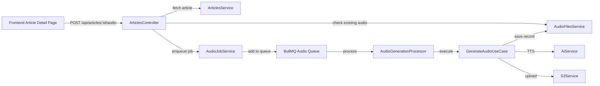

# Plan: Generate Audio for Single Article Endpoint

## Overview

Create a `POST /api/articles/:id/audio` endpoint that triggers an audio generation job for a single article. This endpoint will be called from the frontend's article detail page.

## Current Architecture

The system already has all the building blocks in place:



### Existing Components

- [`ArticlesController`](src/articles/articles.controller.ts) — already has `QueueService` and `S3Service` injected
- [`ArticlesService.getArticleById()`](src/articles/articles.service.ts:316) — fetches article by UUID
- [`AudioFilesService.getAudioFileBySource()`](src/audio-files/audio-files.service.ts:68) — checks if audio already exists for a source
- [`AudioJobService.enqueueAudioJob()`](libs/audio/services/audio-job.service.ts:29) — enqueues audio generation jobs to BullMQ
- [`AudioGenerationProcessor`](libs/queue/processors/audio-generation.processor.ts) — processes audio jobs from the queue
- [`GenerateAudioUseCase`](src/audio-files/usecases/generate-audio.usecase.ts) — orchestrates TTS generation, S3 upload, and DB save
- [`AudioResponseDto`](src/articles/dto/audio-response.dto.ts) — already exists for audio response shape

## Implementation Plan

### 1. Inject `AudioJobService` into `ArticlesController`

The controller already imports `QueueService` but needs [`AudioJobService`](libs/audio/services/audio-job.service.ts) from `@libs/audio` to enqueue audio generation jobs.

**File:** [`src/articles/articles.controller.ts`](src/articles/articles.controller.ts)

- Add `AudioJobService` to the constructor
- Import `AudioJobService` from `@libs/audio`

### 2. Import `AudioModule` in `ArticlesModule`

**File:** [`src/articles/articles.module.ts`](src/articles/articles.module.ts)

- Add `AudioModule` to the `imports` array so `AudioJobService` is available for injection

### 3. Add `POST /api/articles/:id/audio` endpoint

**File:** [`src/articles/articles.controller.ts`](src/articles/articles.controller.ts)

Add a new endpoint with this logic:

```
POST /api/articles/:id/audio
```

**Flow:**
1. Validate `:id` is a valid UUID via `ParseUUIDPipe`
2. Fetch the article using [`ArticlesService.getArticleById()`](src/articles/articles.service.ts:316)
3. Return `404` if article not found
4. Check if audio already exists via [`AudioFilesService.getAudioFileBySource()`](src/audio-files/audio-files.service.ts:68)
5. If audio already exists, return `409 Conflict` with a message indicating audio already exists for this article
6. Determine the text to use for TTS: prefer `processed_content`, fall back to `raw_content`
7. Return `400` if neither content is available
8. Enqueue the audio generation job via [`AudioJobService.enqueueAudioJob()`](libs/audio/services/audio-job.service.ts:29) with fire-and-forget mode
9. Return `202 Accepted` with the `jobId` and status

**Response shape:**
```json
{
  "jobId": "abc-123",
  "status": "queued",
  "message": "Audio generation job queued for article"
}
```

### 4. Add `GET /api/articles/:id/audio/status/:jobId` endpoint (optional but recommended)

**File:** [`src/articles/articles.controller.ts`](src/articles/articles.controller.ts)

This allows the frontend to poll for job completion status.

**Flow:**
1. Use [`AudioJobService.getJobStatus()`](libs/audio/services/audio-job.service.ts:96) to get the job status
2. Return the status or `404` if not found

**Response shape:**
```json
{
  "jobId": "abc-123",
  "state": "completed",
  "progress": 100,
  "result": { "audioKey": "...", "duration": 120 }
}
```

## Files to Modify

| File                                                                         | Change                                                                                                             |
| ---------------------------------------------------------------------------- | ------------------------------------------------------------------------------------------------------------------ |
| [`src/articles/articles.module.ts`](src/articles/articles.module.ts)         | Import `AudioModule`                                                                                               |
| [`src/articles/articles.controller.ts`](src/articles/articles.controller.ts) | Inject `AudioJobService` + `AudioFilesService`, add `POST /:id/audio` and `GET /:id/audio/status/:jobId` endpoints |

## Notes

- No new files need to be created — all building blocks exist
- The endpoint uses **fire-and-forget** mode by default since audio generation can take time; the frontend can poll the status endpoint
- The `processed_content` is preferred over `raw_content` for TTS since it is the AI-summarized version, which produces better audio
- The `409 Conflict` response for existing audio prevents duplicate generation; the frontend can use the existing `GET /api/articles/:id?includeAudio=true` endpoint to fetch the audio if it already exists
