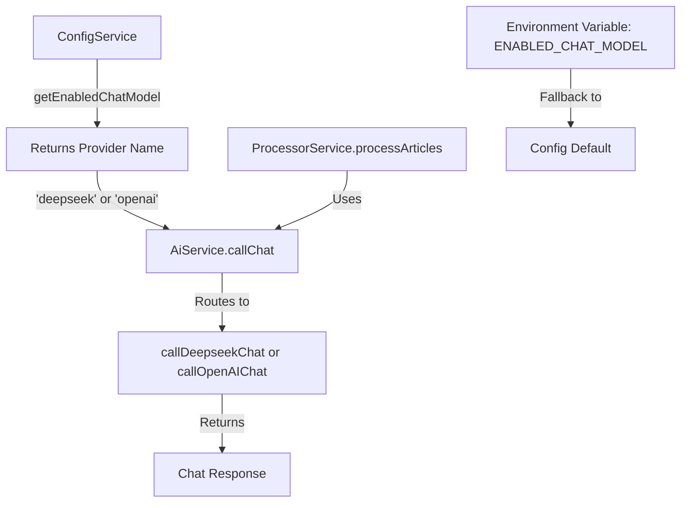

## Plan: Implement Configurable AI Provider for Article Processing

This is a comprehensive plan to implement configurable AI provider selection. Here's the detailed breakdown:

### Architecture Overview



### Implementation Steps

**1. Update Configuration Layer**
   - Modify [`src/config/config.entity.ts`](src/config/config.entity.ts:25) to add `enabledChatModel: string` property to the `models` config object
   - Update [`src/config/config.service.ts`](src/config/config.service.ts:22) to:
     - Add `enabledChatModel: 'deepseek'` as default in CONFIGS
     - Create `getEnabledChatModel()` method that reads from `ENABLED_CHAT_MODEL` env var with fallback to config

**2. Enhance AI Service**
   - Add `callOpenAIChat()` method to [`src/ai/ai.service.ts`](src/ai/ai.service.ts:53) (similar to `callDeepseekChat` but using OpenAI client)
   - Create new generic `callChat()` method that:
     - Calls `getEnabledChatModel()` from ConfigService
     - Routes to appropriate provider method based on config
     - Handles both 'deepseek' and 'openai' providers
   - Keep `callDeepseekChat()` as deprecated wrapper for backward compatibility

**3. Update Processor Service**
   - Modify [`src/processor/processor.service.ts`](src/processor/processor.service.ts:75) line 75 to use `this.aiService.callChat()` instead of `this.aiService.callDeepseekChat()`
   - Also update lines 187 and 292 in the same file for consistency

**4. Environment Configuration**
   - Update [`.env.sample`](.env.sample:1) to add documentation for `ENABLED_CHAT_MODEL` variable with options: 'deepseek' or 'openai'

### Key Design Decisions

- **Scope**: Only `processArticles` function initially (as requested)
- **Configuration**: Environment variable with fallback to config file
- **Backward Compatibility**: Keep `callDeepseekChat()` as deprecated wrapper
- **Provider Routing**: Generic `callChat()` method handles provider selection
- **Extensibility**: Easy to add more providers in the future

### Files to Modify

1. `src/config/config.entity.ts` - Add enabledChatModel property
2. `src/config/config.service.ts` - Add getEnabledChatModel() method
3. `src/ai/ai.service.ts` - Add callOpenAIChat() and callChat() methods
4. `src/processor/processor.service.ts` - Update to use callChat()
5. `.env.sample` - Document ENABLED_CHAT_MODEL variable

### Usage Example

```typescript
// In .env
ENABLED_CHAT_MODEL=openai  // or 'deepseek'

// In processor.service.ts
const summary = await this.aiService.callChat(summaryPrompt);
// Automatically routes to OpenAI or Deepseek based on config
```
