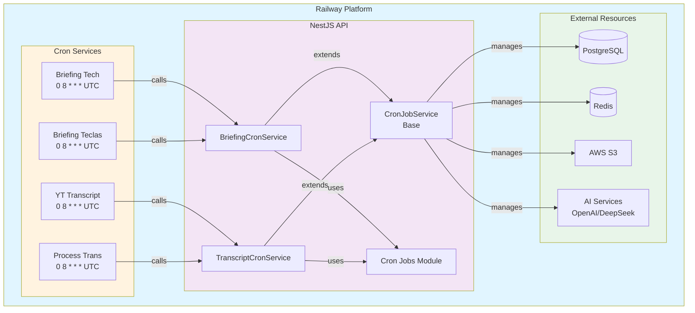
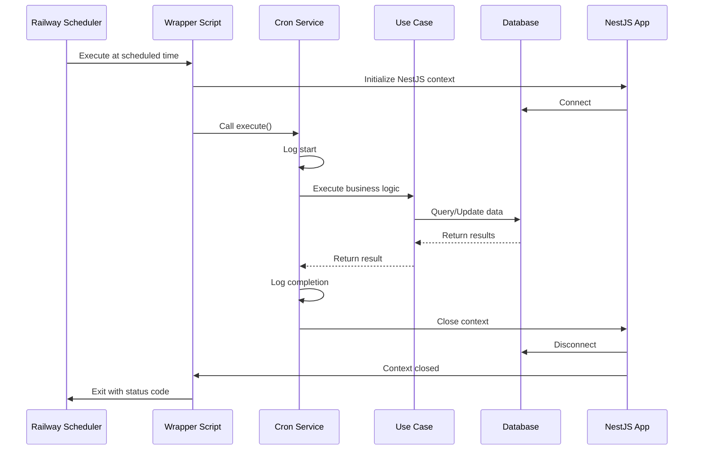
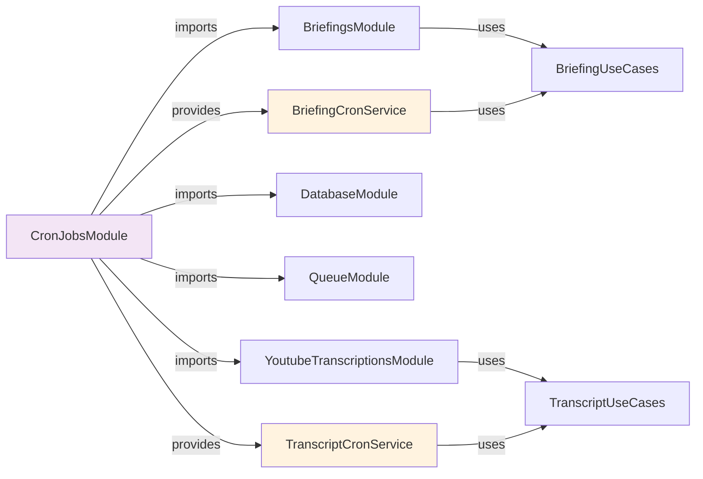
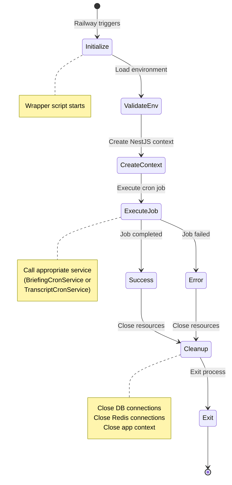
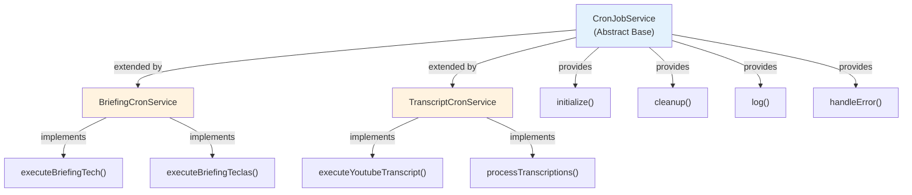
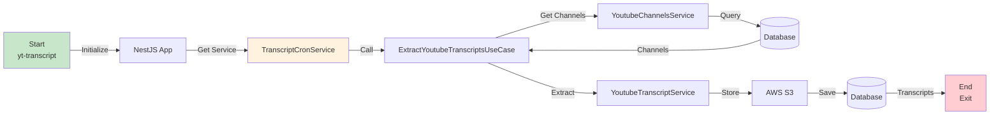
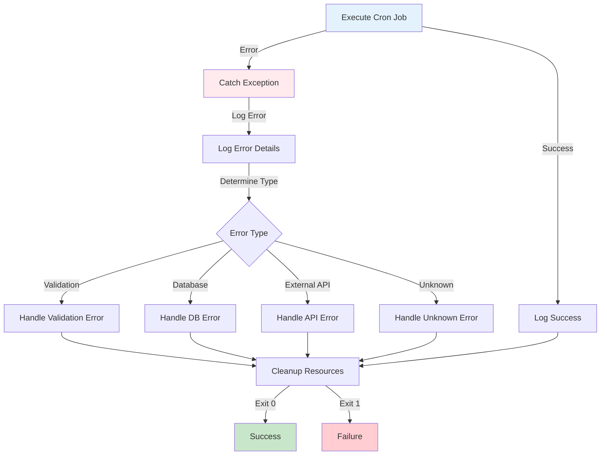
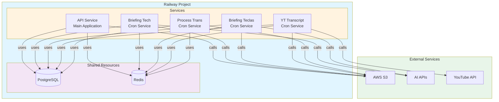

# Cron Jobs Architecture Diagram

## System Architecture

## Cron Job Execution Flow

## Module Dependency Graph

## Cron Job Lifecycle

## Service Hierarchy

## Data Flow for Briefing Cron Job

```mermaid
graph LR
    Start["Start<br/>briefing:tech"] -->|Initialize| App["NestJS App"]
    App -->|Get Service| BCS["BriefingCronService"]
    BCS -->|Call| RBU["RunBriefingUseCase"]

    RBU -->|Scrape| SA["ScrapeArticlesUseCase"]
    SA -->|Query| DB1[(Database)]
    DB1 -->|Articles| PA["ProcessArticlesUseCase"]

    PA -->|Process| RA["RateArticlesUseCase"]
    RA -->|Rate| CA["CategorizeArticlesUseCase"]
    CA -->|Categorize| GB["GenerateBriefUseCase"]

    GB -->|Generate| DB2[(Database)]
    DB2 -->|Briefing| End["End<br/>Exit"]

    style Start fill:#c8e6c9
    style End fill:#ffcdd2
    style BCS fill:#fff3e0
```

## Data Flow for Transcript Cron Job

## Error Handling Flow

## Railway Deployment Architecture

