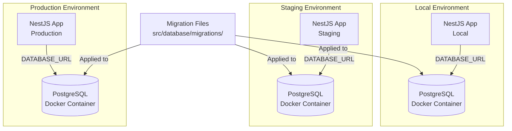

# PostgreSQL Docker & Migrations Setup

## Overview
This plan sets up a PostgreSQL database using Docker with environment-specific configurations, integrates TypeORM for migrations, and creates the initial migration from existing table schemas.

## Architecture

## Implementation Details

### 1. Docker Configuration
- **File**: `docker-compose.yml`
  - Use Docker Compose profiles: `local`, `staging`, `production`
  - PostgreSQL service with environment-specific configurations
  - Volume mounts for data persistence
  - Health checks for database readiness
  - Network configuration for service communication

### 2. TypeORM Integration
- **Install dependencies**: `@nestjs/typeorm`, `typeorm`, `pg`
- **File**: `src/database/typeorm.config.ts`
  - TypeORM configuration module
  - Environment-based connection settings
  - Migration configuration
- **Update**: `src/database/database.module.ts`
  - Integrate TypeORM module
  - Keep existing DatabaseService for backward compatibility

### 3. Migration System
- **Directory**: `src/database/migrations/`
- **Initial migration**: Convert existing `createTables()` logic from [postgres-database.service.ts](src/database/postgres-database.service.ts) into migration files
- **Migration files**: 
  - `0001-InitialSchema.ts` - Create articles, briefings, youtube_transcriptions tables
  - Future migrations will be auto-generated or manually created

### 4. Environment Configuration
- **File**: `.env.example`
  - Database connection variables for all environments
  - Migration configuration variables
- **Update**: Environment variable handling in database services

### 5. Scripts & Commands
- **Update**: `package.json` scripts
  - `migration:generate` - Generate new migration from entity changes
  - `migration:create` - Create empty migration file
  - `migration:run` - Run pending migrations
  - `migration:revert` - Revert last migration
  - `docker:up` - Start database container (local)
  - `docker:down` - Stop database container
  - `docker:logs` - View database logs

### 6. Documentation
- **Update**: `README.md`
  - Docker setup instructions
  - Migration workflow
  - Environment-specific deployment guides

## Files to Create/Modify

### New Files
- `docker-compose.yml` - Docker Compose configuration with profiles
- `src/database/typeorm.config.ts` - TypeORM configuration
- `src/database/migrations/0001-InitialSchema.ts` - Initial migration
- `.env.example` - Environment variables template
- `.dockerignore` - Docker ignore patterns

### Modified Files
- `package.json` - Add TypeORM dependencies and migration scripts
- `src/database/database.module.ts` - Integrate TypeORM
- `src/database/postgres-database.service.ts` - Remove manual table creation (migrations handle this)
- `README.md` - Add Docker and migration documentation

## Migration Workflow

1. **Create new migration**: `npm run migration:create -- AddNewColumnToArticles`
2. **Write SQL/TypeORM code** in the generated migration file
3. **Run migrations**: `npm run migration:run`
4. **In production**: Migrations run automatically on app startup (or manually via CI/CD)

## Environment-Specific Setup

- **Local**: Uses `docker-compose.yml` with `local` profile, connects to `localhost:5432`
- **Staging**: Uses `docker-compose.yml` with `staging` profile, separate volume and network
- **Production**: Uses `docker-compose.yml` with `production` profile, persistent volumes, backup configuration