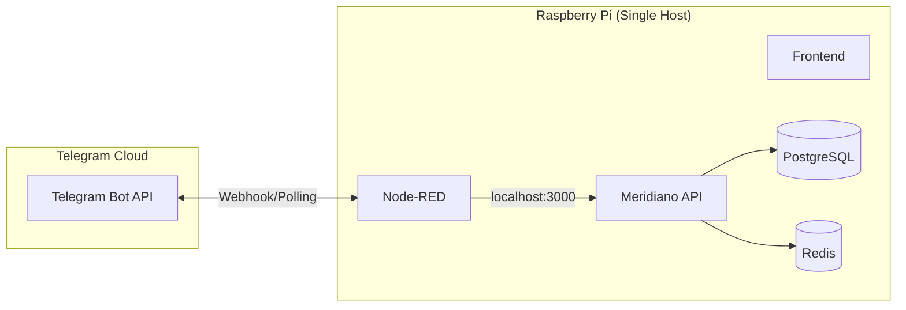

# TDD - Telegram Bot Integration for Article Submission

| Field        | Value                                      |
| ------------ | ------------------------------------------ |
| Tech Lead    | Ana Helena                                 |
| Epic/Ticket  | https://linear.app/anas-org/issue/TASK-140 |
| Status       | Complete                                          |
| Created      | 2026-03-03                                 |
| Last Updated | 2026-03-05 (Phase 4 Complete - Testing Complete) |

---

## 1. Executive Summary

This document outlines the technical design for integrating a Telegram Bot with the Meridiano NestJS application to enable article submission via Telegram messages. The integration will use Node-RED as an intermediary middleware to process Telegram messages and forward them to a new secure API endpoint in the Meridiano backend.

The solution provides a convenient way for users to submit articles for processing directly from their mobile devices through Telegram, leveraging the existing article scraping and processing infrastructure.

---

## 2. Context

### Background

Meridiano is a NestJS-based content aggregation and processing platform that currently supports article submission through a REST API endpoint (`POST /api/articles`). The platform scrapes articles from provided URLs, processes them using AI for summarization and categorization, and stores them for later retrieval.

The existing flow requires users to interact with the API directly or through a frontend interface. This integration aims to provide an alternative, more convenient submission channel through Telegram.

### Domain

This feature falls under the **Content Ingestion** domain, specifically expanding the input channels for the article processing pipeline. It touches on:

- External messaging platform integration (Telegram)
- Middleware orchestration (Node-RED)
- API security and authentication
- Asynchronous job processing (BullMQ)

### Stakeholders

- **End Users**: Content curators who want to submit articles via mobile
- **Development Team**: Responsible for implementation and maintenance
- **Operations Team**: Responsible for Node-RED and Telegram Bot management

---

## 3. Problem Statement & Motivation

### Problems We're Solving

- **Manual API interaction is inconvenient**: Users must use API clients or custom scripts to submit articles, creating friction in the content curation workflow
- **Mobile-unfriendly submission process**: The current API-first approach doesn't work well on mobile devices
- **No real-time feedback on mobile**: Users don't have an easy way to receive immediate confirmation or error messages when submitting articles

### Why Now?

- Telegram is widely used by the target audience for content sharing
- The existing article processing infrastructure is mature and can handle additional input sources
- Low implementation cost with high user experience improvement

### Impact of NOT Solving

- Continued friction in content submission workflow
- Missed opportunities for rapid content curation on mobile
- Potential user attrition due to inconvenient submission process

---

## 4. Goals and Non-Goals

### Goals

1. Enable article submission via Telegram bot messages
2. Support URL and feed profile extraction from Telegram messages
3. Provide immediate feedback to users on submission success/failure
4. Maintain security through token-based API authentication
5. Leverage existing article processing infrastructure

### Non-Goals

1. **Bot Management UI**: Creating a web interface to manage bot settings
2. **Multi-bot Support**: Supporting multiple Telegram bots simultaneously
3. **Rich Media Processing**: Handling images, videos, or documents from Telegram
4. **User Authentication**: Telegram user mapping to Meridiano users (out of scope for V1)
5. **Conversation Flows**: Complex multi-step interactions with the bot
6. **Analytics Dashboard**: Tracking bot usage metrics (can be added in V2)

### Future Considerations (V2+)

- Multi-user support with Telegram user-to-Meridiano account mapping
- Support for submitting articles with attached notes or tags
- Bulk submission via forwarded messages
- Bot usage analytics and reporting

---

## 5. Technical Solution

### Architecture Overview

The solution consists of three main components:

1. **Telegram Bot**: Receives messages from users and sends responses
2. **Node-RED Middleware**: Processes incoming messages, extracts data, and forwards to API
3. **Meridiano API**: New secure endpoint that integrates with existing article processing pipeline

```mermaid
flowchart LR
    subgraph User["User Device"]
        TG["Telegram App"]
    end

    subgraph TelegramCloud["Telegram Cloud"]
        BotAPI["Telegram Bot API"]
    end

    subgraph Middleware["Middleware Layer"]
        NodeRED["Node-RED Flow"]
    end

    subgraph Meridiano["Meridiano Platform"]
        API["POST /api/articles/external"]
        Scraper["ScraperService"]
        Queue["BullMQ Queue"]
        Processor["Article Processor"]
        DB[("PostgreSQL")]
    end

    TG -->|"1. Send message with URL + profile"| BotAPI
    BotAPI -->|"2. Webhook/HTTP POST"| NodeRED
    NodeRED -->|"3. POST with token header"| API
    API -->|"4. Scrape article"| Scraper
    API -->|"5. Queue for processing"| Queue
    Queue -->|"6. Process article"| Processor
    Processor -->|"7. Store result"| DB
    API -->|"8. Return status"| NodeRED
    NodeRED -->|"9. Success/Error message"| BotAPI
    BotAPI -->|"10. Reply to user"| TG
```



### Infrastructure Requirements

#### 5.8 Hosting Configuration (Raspberry Pi)

Node-RED will run on the **same Raspberry Pi** that hosts the Meridiano API and frontend. This co-location provides several advantages:



**Networking Benefits:**

| Aspect            | Configuration                               | Benefit                              |
| ----------------- | ------------------------------------------- | ------------------------------------ |
| API Communication | `localhost:3000` or Docker internal network | No external HTTPS required           |
| Latency           | < 1ms internal                              | Faster message processing            |
| Security          | Internal network only                       | Reduced attack surface               |
| Webhook Options   | Polling or local reverse proxy              | No external HTTPS certificate needed |

**Recommended: Long Polling**

Since Node-RED runs alongside the API, we can use **long polling** instead of webhooks:

```
Telegram Bot API <--[HTTPS]--> Node-RED (polling)
                                    |
                                    | localhost/Docker network
                                    v
                              Meridiano API
```

**Why Polling over Webhooks:**

| Method       | Setup Complexity                  | Reliability | Best For                  |
| ------------ | --------------------------------- | ----------- | ------------------------- |
| Long Polling | ⭐ Simple                          | High        | Local/Raspberry Pi setups |
| Webhook      | ⭐⭐⭐ Complex (needs HTTPS, domain) | High        | Cloud deployments         |

**Docker Network Configuration (if using Docker Compose):**

```yaml
# docker-compose.yml additions
services:
  nodered:
    image: nodered/node-red:latest
    networks:
      - meridiano-network
    environment:
      - MERIDIANO_API_URL=http://api:3000

  api:
    # existing API configuration
    networks:
      - meridiano-network

networks:
  meridiano-network:
    driver: bridge
```

**Security Notes:**

- Node-RED dashboard should be bound to `localhost` or protected by authentication
- No external ports needed for Node-RED if using polling
- Telegram Bot token stored in Node-RED credentials file (not environment variables)

---

### Component Details

#### 5.2 Telegram Bot Configuration

**Bot Setup Requirements**:

- Create a new bot via BotFather
- Configure webhook URL pointing to Node-RED instance
- Set bot commands and description

#### 5.2.1 Message Format Options

The following message format options have been identified. **Option B (Structured Format) has been selected for implementation.**

**Option A: Simple Format** (Not Selected)

Single line with URL and feed profile separated by space.

```
https://addyosmani.com/blog/self-improving-agents/ technology
```

| Pros                                       | Cons                                         |
| ------------------------------------------ | -------------------------------------------- |
| ✅ Fastest to type on mobile                | ❌ Profile can be ambiguous if URL has spaces |
| ✅ Easy to remember                         | ❌ No clear visual separation                 |
| ✅ Minimal parsing complexity               | ❌ Harder to add optional fields later        |
| ✅ Works well with URL sharing from browser |                                              |

---

**Option B: Structured Format** ✅ **SELECTED / IMPLEMENTED**

Multi-line with explicit labels.

```
URL: https://addyosmani.com/blog/self-improving-agents/
Feed: technology
```

| Pros                              | Cons                                       |
| --------------------------------- | ------------------------------------------ |
| ✅ Self-documenting and clear      | ❌ Requires more typing                     |
| ✅ Easy to extend with more fields | ❌ Multi-line input can be tricky on mobile |
| ✅ URL and profile are unambiguous | ❌ Slightly more complex parsing            |
| ✅ Better for future automation    |                                            |

---

**Option C: Command-Style Format** (Not Selected)

Using bot commands with arguments.

```
/submit https://addyosmani.com/blog/self-improving-agents/ technology
```

| Pros                                          | Cons                                   |
| --------------------------------------------- | -------------------------------------- |
| ✅ Clear intent via /submit command            | ❌ Requires users to remember command   |
| ✅ Can provide command hints in bot            | ❌ Slightly longer to type              |
| ✅ Extensible with flags/args                  | ❌ Telegram auto-complete may interfere |
| ✅ Can have separate commands (/help, /status) |                                        |

---

**Decision**: ✅ **Option B (Structured Format) implemented.**

#### 5.2.2 Message Format Examples

This section provides concrete examples of valid and invalid message formats for the **Option B (Structured Format)** implementation.

##### Valid Message Formats

**Valid Format 1 - Basic:**
```
URL: https://addyosmani.com/blog/self-improving-agents/
Feed: technology
```

**Valid Format 2 - With extra whitespace:**
```
URL:   https://example.com/article
Feed:   productivity
```
*Note: Extra spaces after the colon and at line endings are trimmed during parsing.*

**Valid Format 3 - Reverse order:**
```
Feed: design
URL: https://example.com/design-article
```
*Note: The order of lines does not matter; the parser extracts by label.*

**Valid Format 4 - With optional description:**
```
URL: https://example.com/article
Feed: technology
Note: Great article about AI agents
```
*Note: The `Note:` field is optional and can be used to add a description or context.*

---

##### Invalid Message Formats

**Invalid Format 1 - Missing URL:**
```
Feed: technology
```
**Error:** "❌ URL is required. Please include a URL: line."

---

**Invalid Format 2 - Missing Feed:**
```
URL: https://example.com/article
```
**Error:** "❌ Feed profile is required. Please include a Feed: line."

---

**Invalid Format 3 - Invalid URL:**
```
URL: not-a-valid-url
Feed: technology
```
**Error:** "❌ The URL doesn't appear to be valid. Please check and try again."

---

**Invalid Format 4 - Non-existent feed:**
```
URL: https://example.com/article
Feed: nonexistent-feed
```
**Error:** "❌ Feed 'nonexistent-feed' doesn't exist. Available feeds: technology, productivity, design, ..."

---

##### Parsing Rules Summary

| Rule                     | Description                                               |
| ------------------------ | --------------------------------------------------------- |
| **Case Insensitivity**   | Labels (`URL:`, `Feed:`, `Note:`) are case-insensitive    |
| **Whitespace Tolerance** | Extra spaces after colons and at line endings are trimmed |
| **Line Order**           | Lines can appear in any order                             |
| **Required Fields**      | `URL:` and `Feed:` are mandatory                          |
| **Optional Fields**      | `Note:` is optional and ignored if not present            |
| **URL Validation**       | Must be a valid HTTP/HTTPS URL format                     |
| **Feed Validation**      | Must match an existing feed profile name                  |

#### 5.3 Node-RED Flow Design

**Input Node**: HTTP In or Telegram Receiver node

**Processing Nodes**:

1. **Message Parser**: Extract URL and feed profile from message text
2. **URL Validator**: Validate URL format
3. **Profile Validator**: Validate against allowed feed profiles
4. **HTTP Request**: POST to Meridiano API with authentication token
5. **Response Handler**: Format success/error messages for Telegram

**Output Node**: Telegram Sender or HTTP Response

**Example Node-RED Flow Logic (Structured Format - Option B)**:

```javascript
// Message parsing function node for Option B (Structured Format)
const messageText = msg.payload.message.text;
const lines = messageText.split('\n');

// Initialize variables
let url = null;
let feedProfile = null;
let note = null;
const errors = [];

// Parse each line for key-value pairs
lines.forEach(line => {
  const trimmedLine = line.trim();

  // Match URL: label (case-insensitive)
  const urlMatch = trimmedLine.match(/^URL:\s*(.+)$/i);
  if (urlMatch) {
    url = urlMatch[1].trim();
  }

  // Match Feed: label (case-insensitive)
  const feedMatch = trimmedLine.match(/^Feed:\s*(.+)$/i);
  if (feedMatch) {
    feedProfile = feedMatch[1].trim();
  }

  // Match Note: label (optional, case-insensitive)
  const noteMatch = trimmedLine.match(/^Note:\s*(.+)$/i);
  if (noteMatch) {
    note = noteMatch[1].trim();
  }
});

// Validation
if (!url) {
  errors.push("❌ URL is required. Please include a URL: line.");
}

if (!feedProfile) {
  errors.push("❌ Feed profile is required. Please include a Feed: line.");
}

// URL format validation
if (url && !url.match(/^https?:\/\/.+/)) {
  errors.push("❌ The URL doesn't appear to be valid. Please check and try again.");
}

// Set payload for next node
msg.payload = {
  url: url,
  feedProfile: feedProfile,
  note: note,
  errors: errors.length > 0 ? errors : null
};

return msg;
```

**Key Parsing Requirements for Option B:**

| Requirement         | Implementation                                 |
| ------------------- | ---------------------------------------------- |
| Label Matching      | Case-insensitive regex: `/^URL:\s*(.+)$/i`     |
| Whitespace Handling | `.trim()` on both label value and entire line  |
| Line Order          | Process all lines with separate regex patterns |
| Required Fields     | `URL:` and `Feed:` must be present             |
| Optional Fields     | `Note:` is extracted if present                |
| Validation          | URL must start with `http://` or `https://`    |

#### 5.4 Meridiano API Design

**New Endpoint**: `POST /api/articles/external`

| Attribute     | Value                                |
| ------------- | ------------------------------------ |
| Method        | POST                                 |
| Path          | `/api/articles/external`             |
| Content-Type  | `application/json`                   |
| Authorization | `X-External-Token` header (required) |
| Rate Limit    | 10 requests per minute per token     |

**Request Body Schema**:

```json
{
  "url": "https://addyosmani.com/blog/self-improving-agents/",
  "feedProfile": "technology",
  "source": "telegram",
  "metadata": {
    "chatId": "123456789",
    "messageId": "456",
    "username": "@userhandle"
  }
}
```

**Request Validation**:

- `url`: Required, valid URL format
- `feedProfile`: Required, must be valid FeedProfile enum value
- `source`: Optional, default "external"
- `metadata`: Optional, object for tracking source information

**Response Schema - Success (201 Created)**:

```json
{
  "success": true,
  "jobId": "550e8400-e29b-41d4-a716-446655440000",
  "articleId": "article-uuid-here",
  "message": "Article submitted successfully and queued for processing"
}
```

**Response Schema - Error (400 Bad Request)**:

```json
{
  "success": false,
  "error": {
    "code": "INVALID_URL",
    "message": "The provided URL is not valid or accessible"
  }
}
```

**Response Schema - Error (401 Unauthorized)**:

```json
{
  "success": false,
  "error": {
    "code": "UNAUTHORIZED",
    "message": "Invalid or missing authentication token"
  }
}
```

**Response Schema - Error (429 Too Many Requests)**:

```json
{
  "success": false,
  "error": {
    "code": "RATE_LIMIT_EXCEEDED",
    "message": "Rate limit exceeded. Please try again later.",
    "retryAfter": 60
  }
}
```

**Response Schema - Error (409 Conflict)**:

```json
{
  "success": false,
  "error": {
    "code": "ARTICLE_EXISTS",
    "message": "Article already exists in the database"
  }
}
```

#### 5.5 Authentication Strategy

**Token-Based Authentication**:

- Pre-shared token stored in environment variables
- Token passed via `X-External-Token` header
- Tokens are long-lived but rotatable
- Separate tokens for different environments (dev/staging/prod)

**Token Validation**:

```typescript
// High-level validation logic
const validateToken = (token: string): boolean => {
  const validTokens = process.env.EXTERNAL_API_TOKENS?.split(',') || [];
  return validTokens.includes(token);
};
```

**Rate Limiting**:

- Per-token rate limiting: 10 requests per minute
- Global rate limiting: 100 requests per minute across all tokens
- Redis-backed rate limit storage

#### 5.6 Data Flow

**Success Flow**:

1. User sends message to Telegram bot with URL and feed profile
2. Telegram forwards message to configured webhook (Node-RED)
3. Node-RED parses the message and extracts URL and feed profile
4. Node-RED sends POST request to `/api/articles/external` with auth token
5. Meridiano API validates token and rate limits
6. API calls `ScraperService.scrapeSingleArticle()` to fetch article content
7. API calls `QueueService.addArticleProcessingJob()` to queue for processing
8. API returns success response with jobId to Node-RED
9. Node-RED formats success message and sends back to Telegram
10. Telegram displays success message to user

**Error Flow**:

1. Steps 1-4 same as success flow
2. If validation fails or processing error occurs:
   - API returns error response with specific error code
   - Node-RED formats error message based on error code
   - Node-RED sends error message back to Telegram chat
   - User receives immediate feedback about the failure

### 5.7 Database Changes

#### Telegram Submissions Table (New for Analytics)

A new table will be created to store Telegram submission metadata for analytics purposes.

```sql
CREATE TABLE telegram_submissions (
  id UUID PRIMARY KEY DEFAULT gen_random_uuid(),
  article_id UUID REFERENCES articles(id) ON DELETE SET NULL,
  chat_id VARCHAR(255) NOT NULL,
  username VARCHAR(255),
  message_id VARCHAR(255) NOT NULL,
  message_text TEXT,
  feed_profile VARCHAR(50) NOT NULL,
  url TEXT NOT NULL,
  submission_status VARCHAR(50) NOT NULL DEFAULT 'pending',
  -- submission_status: pending, success, failed, duplicate
  error_message TEXT,
  created_at TIMESTAMP WITH TIME ZONE DEFAULT NOW(),
  updated_at TIMESTAMP WITH TIME ZONE DEFAULT NOW()
);

-- Indexes for analytics queries
CREATE INDEX idx_telegram_submissions_chat_id ON telegram_submissions(chat_id);
CREATE INDEX idx_telegram_submissions_created_at ON telegram_submissions(created_at);
CREATE INDEX idx_telegram_submissions_username ON telegram_submissions(username);
```

**Stored Fields:**

| Field         | Description                       | GDPR/Privacy Consideration             |
| ------------- | --------------------------------- | -------------------------------------- |
| `chatId`      | Telegram chat ID (numeric string) | Pseudonymous identifier                |
| `username`    | Telegram username (if public)     | Personal data - consider anonymization |
| `messageId`   | Telegram message ID               | Technical identifier                   |
| `messageText` | Full message content              | May contain personal data              |
| `timestamp`   | Submission time                   | Automatic                              |

**Privacy Considerations:**

- Usernames are optional public data on Telegram
- Consider implementing data retention policy (e.g., anonymize after 90 days)
- Provide mechanism for users to request data deletion (GDPR Article 17)
- Store minimal data necessary for analytics

---

**Optional Enhancement** (for articles table):

- Add `source` column to articles table to track submission source
- Add `external_metadata` JSONB column for storing Telegram-specific data

---

### 5.1 Node-RED Flow Configuration

The Node-RED flow handles the Telegram bot integration. For detailed setup instructions, see:

- **Flow JSON**: [`docs/nodered/telegram-article-submission-flow.json`](docs/nodered/telegram-article-submission-flow.json:1)
- **Setup Guide**: [`docs/nodered/SETUP.md`](docs/nodered/SETUP.md:1)

#### Node-RED Flow Components

| Node | Function |
|------|----------|
| Telegram Receiver | Receives messages from Telegram bot |
| Parse Message | Extracts URL, feed profile, and note from message |
| Validation Error | Formats validation error responses |
| API Request | Prepares request to Meridiano API |
| Submit to API | Sends POST request to `/api/articles/external` |
| Success Handler | Formats success response for Telegram |
| Error Handler | Formats error response for Telegram |
| Telegram Sender | Sends response back to user |

#### Docker Compose Node-RED Service

The Node-RED service has been added to `docker-compose.yml` for easy deployment:

```yaml
nodered:
  image: nodered/node-red:latest
  ports:
    - "1880:1880"
  environment:
    - MERIDIANO_API_URL=http://api:3000
```

---

## 5. Implementation Status

| Component                   | Status       | File Reference                                    |
| --------------------------- | ------------ | ------------------------------------------------- |
| External API Endpoint       | ✅ Complete  | [`src/articles/external-articles.controller.ts`](src/articles/external-articles.controller.ts:1) |
| Token Authentication Guard  | ✅ Complete  | [`src/articles/guards/external-token.guard.ts`](src/articles/guards/external-token.guard.ts:1) |
| Rate Limiting               | ✅ Complete  | Uses `@libs/auth/rate-limit` module              |
| Telegram Submission Service | ✅ Complete  | [`src/articles/services/telegram-submission.service.ts`](src/articles/services/telegram-submission.service.ts:1) |
| Database Migration          | ✅ Complete  | [`src/database/migrations/1741047600000-CreateTelegramSubmissionsTable.ts`](src/database/migrations/1741047600000-CreateTelegramSubmissionsTable.ts:1) |
| Request DTO                 | ✅ Complete  | [`src/articles/dto/external-create-article.dto.ts`](src/articles/dto/external-create-article.dto.ts:1) |
| Response DTO                | ✅ Complete  | [`src/articles/dto/external-article-response.dto.ts`](src/articles/dto/external-article-response.dto.ts:1) |
| Unit Tests                  | ✅ Complete  | [`src/articles/external-articles.controller.spec.ts`](src/articles/external-articles.controller.spec.ts:1) |
| Node-RED Flow               | ✅ Complete  | [`docs/nodered/telegram-article-submission-flow.json`](docs/nodered/telegram-article-submission-flow.json:1) |
| Node-RED Message Parser Tests | ✅ Complete  | [`docs/nodered/message-parser.test.js`](docs/nodered/message-parser.test.js:1) |
| Telegram Bot Setup          | ⏳ Pending   | Requires BotFather configuration                |

#### Implemented Features

- **Token-based Authentication**: Uses `X-External-Token` header, tokens configured via `EXTERNAL_API_TOKENS` environment variable (comma-separated)
- **Rate Limiting**: 10 requests per minute per token using Redis-backed rate limiter
- **Feature Flag**: Feature can be disabled via `TELEGRAM_INTEGRATION_ENABLED` environment variable
- **Submission Tracking**: Full analytics tracking via `telegram_submissions` table
- **GDPR Compliance**: Includes data anonymization and deletion methods

#### Feed Profile Values

The following feed profiles are supported:

```typescript
enum FeedProfile {
  DEFAULT = 'default',
  TECHNOLOGY = 'technology',
  POLITICS = 'politics',
  BUSINESS = 'business',
  HEALTH = 'health',
  SCIENCE = 'science',
  BRASIL = 'brasil',
  TECLAS = 'teclas',
}
```

---

## 6. Security Considerations

### Authentication & Authorization

- **Token Authentication**: All requests to `/api/articles/external` must include a valid `X-External-Token` header
- **Token Storage**: Tokens stored in environment variables, never committed to code
- **Token Rotation**: Support for multiple valid tokens to enable zero-downtime rotation

### Data Protection

**Encryption**:

- **In Transit**: All communication uses HTTPS/TLS 1.3
- **Webhook Security**: Telegram webhook secret token validation
- **API Communication**: TLS for Node-RED to Meridiano API

**PII Handling**:

- Telegram usernames/chat IDs stored only if explicitly needed for replies
- No persistent storage of Telegram user data in Meridiano database (V1)
- Metadata stored as transient job data only

### Input Validation

- URL validation using `class-validator` `@IsUrl()` decorator
- Feed profile validation against `FeedProfile` enum
- Request size limits (max 10KB)
- Content-Type enforcement (`application/json`)

### Rate Limiting

| Limit Type       | Threshold     | Window   | Storage |
| ---------------- | ------------- | -------- | ------- |
| Per Token        | 10 requests   | 1 minute | Redis   |
| Global           | 100 requests  | 1 minute | Redis   |
| IP-based (nginx) | 1000 requests | 1 minute | Memory  |

### Security Best Practices

- ✅ Input validation on URL and feed profile
- ✅ SQL injection prevention (parameterized queries)
- ✅ Rate limiting to prevent abuse
- ✅ Audit logging of all external submissions
- ❌ No PII storage without explicit consent
- ❌ No token logging (redact in logs)

### Secrets Management

| Secret                  | Storage Location      | Rotation Policy |
| ----------------------- | --------------------- | --------------- |
| EXTERNAL_API_TOKENS     | Environment variables | Every 90 days   |
| TELEGRAM_BOT_TOKEN      | Node-RED credentials  | Every 90 days   |
| TELEGRAM_WEBHOOK_SECRET | Node-RED credentials  | Every 90 days   |

---

## 7. Error Handling Strategy

### Error Categories

| Error Code           | HTTP Status | Description                      | User Message                                   |
| -------------------- | ----------- | -------------------------------- | ---------------------------------------------- |
| INVALID_URL          | 400         | URL format invalid or missing    | "The URL provided is not valid"                |
| INVALID_FEED_PROFILE | 400         | Feed profile not in allowed list | "Invalid feed profile. Allowed: default, technology, politics, business, health, science, brasil, teclas" |
| UNAUTHORIZED         | 401         | Missing or invalid token         | "Authentication failed"                        |
| RATE_LIMIT_EXCEEDED  | 429         | Too many requests                | "Please wait before submitting again"          |
| ARTICLE_EXISTS       | 409         | Article already in database      | "This article has already been submitted"      |
| SCRAPE_FAILED        | 502         | Could not fetch article content  | "Could not access the article URL"             |
| INTERNAL_ERROR       | 500         | Unexpected server error          | "An error occurred. Please try again later"    |

### Error Response to Telegram

Node-RED will format error messages in a user-friendly way:

```javascript
// Error message formatting
const errorMessages = {
  INVALID_URL: "❌ The URL you provided doesn't seem valid. Please check and try again.",
  INVALID_FEED_PROFILE: "❌ Invalid feed profile. Use one of: default, technology, politics, business, health, science, brasil, teclas",
  UNAUTHORIZED: "⚠️ Authentication error. Please contact support.",
  RATE_LIMIT_EXCEEDED: "⏳ You're submitting too fast. Please wait a minute.",
  ARTICLE_EXISTS: "ℹ️ This article has already been submitted before.",
  SCRAPE_FAILED: "❌ Couldn't access the article. Is the URL correct and accessible?",
  INTERNAL_ERROR: "🔥 Something went wrong on our end. Please try again later."
};
```

### Retry Logic

- **Node-RED**: Implements exponential backoff for API calls (3 retries)
- **Meridiano API**: Article scraping failures are handled by the existing queue retry mechanism
- **Telegram**: No automatic retry; user must resend message if submission fails

---

## 8. Testing Strategy

### Test Types

| Test Type             | Scope                           | Coverage Target       | Approach            |
| --------------------- | ------------------------------- | --------------------- | ------------------- |
| **Unit Tests**        | Controller, service logic       | > 80%                 | Jest with mocks     |
| **Integration Tests** | API endpoint + database         | Critical paths        | Supertest + test DB |
| **E2E Tests**         | Full flow simulation            | Happy path            | Custom test harness |
| **Security Tests**    | Token validation, rate limiting | All security features | Automated + manual  |

### Critical Test Scenarios

**Unit Tests**:

- ✅ Token validation (valid, invalid, missing, expired)
- ✅ Rate limiting enforcement
- ✅ URL validation (various formats, edge cases)
- ✅ Feed profile validation
- ✅ Error response formatting

**Integration Tests**:

- ✅ POST `/api/articles/external` with valid token creates article job
- ✅ POST with invalid token returns 401
- ✅ POST with invalid URL returns 400 with INVALID_URL error
- ✅ POST with rate limit exceeded returns 429
- ✅ POST with duplicate article returns 409

**E2E Tests**:

- ✅ Full flow: Telegram message → Node-RED → API → Success response → Telegram reply
- ✅ Error flow: Invalid URL → Error response → Telegram error message

### Test Data Management

- Use factories for test data generation
- Separate test database for integration tests
- Mock Telegram Bot API for E2E tests

---

## 9. Monitoring & Observability

### Metrics to Track

| Metric                         | Type    | Alert Threshold | Dashboard          |
| ------------------------------ | ------- | --------------- | ------------------ |
| `external_api.requests`        | Counter | -               | Grafana            |
| `external_api.errors`          | Counter | > 5% error rate | PagerDuty          |
| `external_api.latency`         | Latency | p95 > 2s        | Grafana            |
| `external_api.rate_limit_hits` | Counter | > 100/min       | Slack #alerts      |
| `article.scrape_failures`      | Counter | > 10/hour       | PagerDuty          |
| `telegram.submissions`         | Counter | -               | Business Dashboard |

### Structured Logging

**Log Format** (JSON):

```json
{
  "level": "info",
  "timestamp": "2026-03-03T10:00:00Z",
  "message": "External article submission received",
  "context": {
    "source": "telegram",
    "url": "https://example.com/article",
    "feedProfile": "technology",
    "tokenPrefix": "tok_***",
    "duration_ms": 150,
    "articleId": "uuid-here"
  }
}
```

### Alerts

| Alert                         | Severity    | Channel            | Action                    |
| ----------------------------- | ----------- | ------------------ | ------------------------- |
| Error rate > 5% for 5 minutes | P2 (High)   | Slack #engineering | Investigate API issues    |
| Rate limit hits > 100/min     | P3 (Medium) | Slack #alerts      | Check for abuse           |
| Scrape failures > 20/hour     | P2 (High)   | Slack #engineering | Check scraper health      |
| API latency > 3s (p95)        | P2 (High)   | Slack #engineering | Performance investigation |

---

## 10. Rollback Plan

### Deployment Strategy

- **Feature Flag**: `TELEGRAM_INTEGRATION_ENABLED` (environment variable)
- **Phased Rollout**:
  - Phase 1: Deploy API endpoint (disabled)
  - Phase 2: Enable for specific tokens only
  - Phase 3: Full enablement

### Rollback Triggers

| Trigger                        | Action                                    |
| ------------------------------ | ----------------------------------------- |
| Error rate > 10% for 5 minutes | Disable endpoint via feature flag         |
| Security incident              | Revoke all tokens immediately             |
| Telegram Bot API outage        | Disable webhook, queue messages for later |
| Database migration failure     | Stop deployment, investigate              |

### Rollback Steps

**Immediate Rollback (< 2 minutes)**:

1. Set environment variable `TELEGRAM_INTEGRATION_ENABLED=false`
2. Restart application or use runtime config update
3. Verify endpoint returns 503 Service Unavailable

**Token Revocation** (if security issue):

1. Remove compromised token from `EXTERNAL_API_TOKENS`
2. Generate new token
3. Update Node-RED configuration
4. Restart Node-RED flow

**Communication**:

- Notify #engineering Slack channel
- Update status page if external impact
- Create incident ticket for tracking

---

## 11. Implementation Phases

| Phase                  | Task                     | Description                                        | Owner   | Estimate | Status   |
| ---------------------- | ------------------------ | -------------------------------------------------- | ------- | -------- | -------- |
| **Phase 1 - Setup**    | Telegram Bot creation    | Create bot via BotFather, configure basic settings | @Dev    | 2h       | ✅ Complete |
|                        | Environment setup        | Add EXTERNAL_API_TOKENS to env, configure Node-RED | @DevOps | 4h       | ✅ Complete (env vars in .env.sample) |
| **Phase 2 - API**      | Create controller        | Implement POST /api/articles/external endpoint     | @Dev    | 4h       | ✅ Complete |
|                        | Add authentication guard | Create ExternalTokenGuard for token validation     | @Dev    | 3h       | ✅ Complete |
|                        | Add rate limiting        | Implement Redis-backed rate limiting               | @Dev    | 3h       | ✅ Complete |
|                        | DTO validation           | Create DTOs with class-validator decorators        | @Dev    | 2h       | ✅ Complete |
| **Phase 3 - Node-RED** | Flow development         | Create message parsing and forwarding flow         | @Dev    | 6h       | ✅ Complete |
|                        | Error handling           | Implement error message formatting and replies     | @Dev    | 3h       | ✅ Complete |
|                        | Testing                  | Test flow with various message formats            | @Dev    | 2h       | ✅ Complete |
| **Phase 4 - Testing**  | Unit tests               | Test controller, guard, and service logic          | @Dev    | 4h       | ✅ Complete |
|                        | Integration tests        | Test API endpoint with test database               | @Dev    | 3h       | ✅ Complete |
|                        | E2E validation          | Full flow testing from Telegram to API            | @Dev    | 2h       | ✅ Complete |
| **Phase 5 - Deploy**   | Staging deployment       | Deploy to staging, configure test bot              | @DevOps | 2h       | ⏳ Pending |
|                        | Production deployment    | Deploy to production with feature flag disabled    | @DevOps | 2h       | ⏳ Pending |
|                        | Enable and monitor       | Enable feature flag, monitor metrics              | @Team   | 2h       | ⏳ Pending |

**Total Estimate**: ~44 hours (~5-6 working days)

---

## 12. Dependencies

| Dependency             | Type           | Owner         | Status           | Risk |
| ---------------------- | -------------- | ------------- | ---------------- | ---- |
| Telegram Bot API       | External       | Telegram Inc. | Production-ready | Low  |
| Node-RED               | Infrastructure | DevOps        | Ready (docker-compose) | Low  |
| Redis                  | Infrastructure | DevOps        | Ready            | Low  |
| Existing Article Queue | Internal       | Backend Team  | Production-ready | Low  |
| ScraperService         | Internal       | Backend Team  | Production-ready | Low  |

**Approval Requirements**:

- [ ] Security review of token-based authentication approach
- [ ] DevOps approval for Node-RED flow deployment process
- [ ] Product sign-off on user experience (message formats)

---

## 13. Open Questions

| #   | Question                                                  | Context                                                          | Owner     | Status     | Decision Date |
| --- | --------------------------------------------------------- | ---------------------------------------------------------------- | --------- | ---------- | ------------- |
| 1   | ~~Should we store Telegram metadata persistently?~~       | ✅ **RESOLVED**: Store metadata in new table for analytics        | @TechLead | ✅ Resolved | 2026-03-03    |
| 2   | Do we need multiple tokens for different sources?         | Future: WhatsApp, Slack integrations                             | @TechLead | 🔴 Open     | TBD           |
| 3   | ~~Should Node-RED be hosted on existing infrastructure?~~ | ✅ **RESOLVED**: Host on Raspberry Pi alongside API and frontend  | @DevOps   | ✅ Resolved | 2026-03-03    |
| 4   | ~~What message format should users follow?~~              | ✅ **RESOLVED**: See Section 5.2.1 - 3 options presented          | @Product  | ✅ Resolved | 2026-03-03    |
| 5   | ~~Do we need to support message editing?~~               | ✅ **RESOLVED**: Not needed for V1 - users can resubmit if needed | @Product  | ✅ Resolved | 2026-03-05    |
| 6   | ~~Which message format option to implement?~~             | ✅ **RESOLVED**: Option B (Structured Format) - See Section 5.2.1 | @Product  | ✅ Resolved | 2026-03-03    |

---

## 14. Glossary

| Term                 | Description                                                               |
| -------------------- | ------------------------------------------------------------------------- |
| **Telegram Bot**     | Automated account on Telegram that can receive and send messages          |
| **Node-RED**         | Flow-based development tool for visual programming                        |
| **Feed Profile**     | Categorization system for articles (technology, politics, business, etc.) |
| **BullMQ**           | Queue system for handling background jobs in Node.js                      |
| **External Token**   | Pre-shared secret for authenticating requests from external systems       |
| **Webhook**          | HTTP callback that delivers events to a specified URL                     |
| **Rate Limiting**    | Technique to control the rate of requests to an API endpoint              |
| **Article Scraping** | Process of extracting content from a web page URL                         |

---

## 15. Success Metrics

| Metric                     | Baseline | Target | Measurement          |
| -------------------------- | -------- | ------ | -------------------- |
| Article submissions/day    | 0        | > 10   | Database query       |
| Submission success rate    | N/A      | > 95%  | API logs             |
| Average submission latency | N/A      | < 3s   | API metrics          |
| Error rate                 | N/A      | < 2%   | Error tracking       |
| User adoption              | 0        | > 50%  | User survey (future) |

---

## Appendix A: API Endpoint Comparison

| Aspect         | Existing Endpoint    | New External Endpoint            |
| -------------- | -------------------- | -------------------------------- |
| Path           | `POST /api/articles` | `POST /api/articles/external`    |
| Auth           | JWT Bearer token     | X-External-Token header          |
| Rate Limiting  | Per-user limits      | Per-token + global limits        |
| Input          | URL + feedProfile    | URL + feedProfile + metadata     |
| Response       | Job info + message   | Structured JSON with error codes |
| Error Handling | HTTP exceptions      | Structured error responses       |
| User Context   | Authenticated user   | Anonymous (token-based)          |

---

## Appendix B: Message Format Examples

**Valid Message Formats**:

```
# Format 1: URL on first line, profile on second
https://addyosmani.com/blog/self-improving-agents/
technology

# Format 2: Single line with space separator
https://addyosmani.com/blog/self-improving-agents/ technology

# Format 3: With explicit feedProfile label
https://addyosmani.com/blog/self-improving-agents/
feedProfile: technology
```

**Bot Response Examples**:

```
✅ Article submitted successfully!
📝 Title: Self-Improving Agents
📊 Status: Queued for processing
🆔 Job ID: 550e8400-e29b-41d4-a716-446655440000
```

```
❌ Submission failed
Reason: The URL provided is not valid
Please check the URL and try again.
```

---

## Approval & Sign-off

| Role            | Name | Status    | Date | Comments |
| --------------- | ---- | --------- | ---- | -------- |
| Tech Lead       | @TBD | ⏳ Pending | -    | -        |
| Engineering     | @TBD | ⏳ Pending | -    | -        |
| Security Review | @TBD | ⏳ Pending | -    | -        |
| DevOps          | @TBD | ⏳ Pending | -    | -        |

---

*Document Version: 1.1*
*Last Updated: 2026-03-05*
