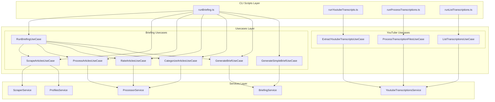

# CLI to Usecases Refactoring Plan

## Overview
Convert the 4 CLI scripts into reusable usecases with clear contracts, making the business logic decoupled from CLI execution and easily testable.

## Architecture



## Directory Structure

Create new directory structure:

```
src/usecases/
├── briefing/
│   ├── dto/
│   │   ├── scrape-articles.dto.ts
│   │   ├── process-articles.dto.ts
│   │   ├── rate-articles.dto.ts
│   │   ├── categorize-articles.dto.ts
│   │   ├── generate-brief.dto.ts
│   │   └── run-briefing.dto.ts
│   ├── scrape-articles.usecase.ts
│   ├── process-articles.usecase.ts
│   ├── rate-articles.usecase.ts
│   ├── categorize-articles.usecase.ts
│   ├── generate-brief.usecase.ts
│   ├── generate-simple-brief.usecase.ts
│   └── run-briefing.usecase.ts (orchestrator)
├── youtube-transcriptions/
│   ├── dto/
│   │   ├── extract-youtube-transcripts.dto.ts
│   │   ├── process-transcription-files.dto.ts
│   │   └── list-transcriptions.dto.ts
│   ├── extract-youtube-transcripts.usecase.ts
│   ├── process-transcription-files.usecase.ts
│   └── list-transcriptions.usecase.ts
└── usecases.module.ts
```

## Implementation Steps

### 1. Create Usecases Module
- Create [`src/usecases/usecases.module.ts`](src/usecases/usecases.module.ts)
- Import all necessary service modules (ScraperModule, ProcessorModule, BriefingModule, YoutubeTranscriptionsModule, ProfilesModule)
- Export all usecases for consumption by CLI scripts

### 2. Briefing Usecases

#### Individual Stage Usecases
Extract business logic from [`src/scripts/runBriefing.ts`](src/scripts/runBriefing.ts):

- **ScrapeArticlesUseCase**: Lines 62-68
  - Input: `{ feedProfile: FeedProfile, feedUrls: string[] }`
  - Output: `{ newArticles: number, errors: number }`
  - Depends on: ScraperService

- **ProcessArticlesUseCase**: Lines 70-74
  - Input: `{ feedProfile: FeedProfile }`
  - Output: `{ articlesProcessed: number, errors: number }`
  - Depends on: ProcessorService

- **RateArticlesUseCase**: Lines 77-82
  - Input: `{ feedProfile: FeedProfile }`
  - Output: `{ articlesRated: number, errors: number }`
  - Depends on: ProcessorService

- **CategorizeArticlesUseCase**: Lines 84-89
  - Input: `{ feedProfile: FeedProfile }`
  - Output: `{ articlesCategorized: number, errors: number }`
  - Depends on: ProcessorService

- **GenerateBriefUseCase**: Lines 91-106
  - Input: `{ feedProfile: FeedProfile }`
  - Output: `{ success: boolean, briefingId?: string, stats?: {...}, error?: string }`
  - Depends on: BriefingService

- **GenerateSimpleBriefUseCase**: Lines 177-187
  - Input: `{ feedProfile: FeedProfile }`
  - Output: `{ success: boolean, briefingId?: string, error?: string }`
  - Depends on: BriefingService

#### Orchestrator Usecase
- **RunBriefingUseCase**: Lines 41-115 (runAll function)
  - Orchestrates all stages in sequence
  - Input: `{ feedProfile: FeedProfile }`
  - Output: Combined statistics from all stages
  - Depends on: All individual briefing usecases + ProfilesService

### 3. YouTube Transcription Usecases

#### ExtractYoutubeTranscriptsUseCase
From [`src/scripts/runYoutubeTranscripts.ts`](src/scripts/runYoutubeTranscripts.ts) lines 20-73:
- Input: `{ channels: ChannelConfig[] }`
- Output: `{ success: boolean, channelsProcessed: number }`
- Depends on: YoutubeTranscriptionsService, ConfigService
- Logic: Filter enabled channels and call extractAll

#### ProcessTranscriptionFilesUseCase
From [`src/scripts/runProcessTranscriptions.ts`](src/scripts/runProcessTranscriptions.ts) lines 31-157:
- Input: `{ transcriptsDir?: string }` (defaults to ./transcripts)
- Output: `{ totalFiles: number, processed: number, skipped: number, errors: number, errorDetails: Array<...> }`
- Depends on: YoutubeTranscriptionsService, ConfigService
- Logic: Read JSON files, validate channels, process each file

#### ListTranscriptionsUseCase
From [`src/scripts/runListTranscriptions.ts`](src/scripts/runListTranscriptions.ts) lines 17-90:
- Input: None (or optional filters in the future)
- Output: `{ transcriptions: YoutubeTranscription[], statistics: { total: number, withSummary: number, channelCounts: Record<string, number> } }`
- Depends on: YoutubeTranscriptionsService
- Logic: Get all transcriptions and compute statistics

### 4. Refactor CLI Scripts

Update all 4 scripts to be thin wrappers:
1. Parse command line arguments
2. Initialize NestJS context
3. Get usecase from DI container
4. Execute usecase with input DTO
5. Format and display output
6. Handle errors

Example pattern for [`src/scripts/runBriefing.ts`](src/scripts/runBriefing.ts):
```typescript
// Parse with Commander (keep existing)
const options = program.opts();

// Initialize
const app = await NestFactory.createApplicationContext(AppModule);
const runBriefingUseCase = app.get(RunBriefingUseCase);
const scrapeUseCase = app.get(ScrapeArticlesUseCase);
// ... etc

// Execute based on flags
if (options.scrape) {
  const result = await scrapeUseCase.execute({ feedProfile, feedUrls });
  console.log(`Scraping completed. New articles: ${result.newArticles}`);
}
```

### 5. Update AppModule

Import UsecasesModule into [`src/app.module.ts`](src/app.module.ts):
```typescript
@Module({
  imports: [
    // ... existing modules
    UsecasesModule,
  ],
})
```

## DTO Pattern

Each usecase will have:
- **Input DTO**: Defines required parameters (use class-validator decorators)
- **Output DTO**: Defines return structure (typed interface or class)

Example:
```typescript
// scrape-articles.dto.ts
export class ScrapeArticlesInputDto {
  @IsEnum(FeedProfile)
  feedProfile: FeedProfile;
  
  @IsArray()
  @IsString({ each: true })
  feedUrls: string[];
}

export interface ScrapeArticlesOutputDto {
  newArticles: number;
  errors: number;
}
```

## Benefits

1. **Decoupling**: Business logic separated from CLI concerns
2. **Reusability**: Usecases can be called from HTTP controllers, queues, or other scripts
3. **Testability**: Easy to unit test usecases without dealing with CLI parsing
4. **Type Safety**: Input/output DTOs provide clear contracts
5. **Composability**: Orchestrator usecases can combine individual usecases
6. **Maintainability**: Single responsibility - each usecase does one thing well

## Testing Strategy

Each usecase should have a corresponding `.spec.ts` file:
- Mock service dependencies
- Test various input scenarios
- Verify output DTOs
- Test error handling

## Notes

- Keep CLI scripts for backward compatibility with existing npm scripts in [`package.json`](package.json)
- Usecases are also useful if you want to expose these operations via HTTP API later
- Consider adding validation pipes to usecases if input validation is needed
